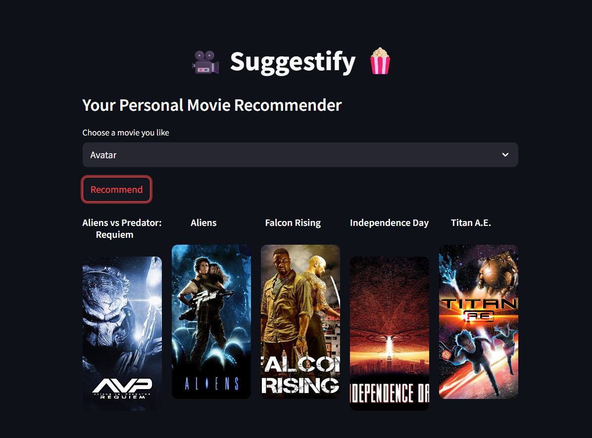

# 🎥 Suggestify 🍿  
Your Personal Movie Recommender System built with Streamlit

---

## 📌 What is a Recommendation System?

A **recommendation system** is a type of information filtering system that suggests relevant items (like movies, products, or content) to users based on their preferences. These systems are widely used on platforms like Netflix, YouTube, and Amazon.

### 🧠 Types of Recommendation Systems:
1. **Content-Based Filtering** – Recommends items similar to those the user liked in the past.
2. **Collaborative Filtering** – Recommends items based on user-user or item-item similarities.
3. **Hybrid Systems** – Combine both content-based and collaborative approaches.

---

## 📊 About This Project

In this project, I built a **Content-Based Movie Recommender System** using the [TMDB Movie Dataset](https://www.kaggle.com/datasets/tmdb/tmdb-movie-metadata) from Kaggle.

### 📁 Datasets Used:
- **`tmdb_5000_movies.csv`**
- **`tmdb_5000_credits.csv`**

These datasets were merged and cleaned to retain only the essential columns:
- `movie_id`
- `title`
- `tags` (custom generated feature combining overview, cast, crew, keywords, genres, etc.)

---

## 🧪 ML Workflow

### 1. **Data Preprocessing**
- **`To analyze and filter out the required data from raw data,
our data may contain null values or missing values. It is necessary to fix that. `**
- **`Removing stopwords is also an essential part.`**
- **`Also, we have used Stemming to find the root words from every column, to use later for tags`**

### 2. **Text Vectorization**
To convert text data (`tags`) into numerical format, I used **Bag of Words (BoW)** model via `CountVectorizer`.

> **Vectorization** is the process of turning textual data into numerical features that machine learning models can understand.

I chose:
- `CountVectorizer(max_features=5000, stop_words='english')`
- Performed **Stemming** to reduce words to their root forms.

### 2. **Similarity Calculation**
Calculated pairwise **cosine similarity** between all movie vectors using `scikit-learn`.

## 🧠 Recommendation Logic

When a user selects a movie, the app:

1. Finds its vector  
2. Computes cosine similarity with all other movie vectors  
3. Returns the top 5 most similar movies  

---

## 💡 Tools & Technologies

| Tool          | Usage                                |
|---------------|--------------------------------------|
| Pandas        | Data manipulation and preprocessing  |
| Scikit-learn  | CountVectorizer & Cosine Similarity  |
| Numpy         | Numerical operations                 |
| Streamlit     | Interactive frontend UI              |

---

## 🖥️ Web App Interface (Built using Streamlit)

- Select a movie from a dropdown  
- Click “Recommend”  
- Get top 5 similar movies with their posters  
- Posters are loaded from a local `posters/` directory  
- If a poster is missing, a placeholder is shown  

---

# ❌ GitHub Note
Due to size limits, the following are not included in this GitHub repo:

## similarity.pkl
## movies_dict.pkl

Please download these from the notebook execution or generate them by running the Jupyter notebook provided.

# 📘 Resources
### 🔗 Dataset: TMDB Movie Metadata on Kaggle

### 📚 NLP Technique: Bag of Words (BoW)

### 🔗 Streamlit Docs: https://docs.streamlit.io/

### 🙋‍♀️ Author
#### Nandinee Sharma
#### 📧 nandineesharma2004@gmail.com

